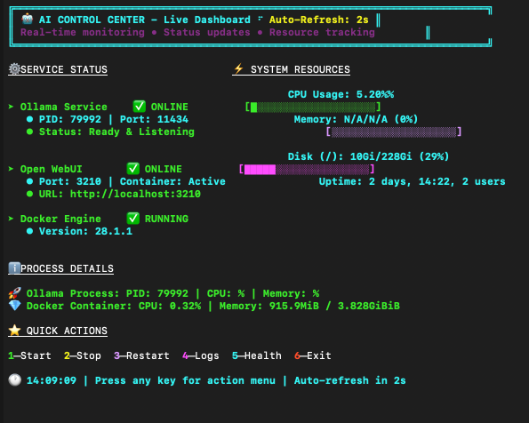
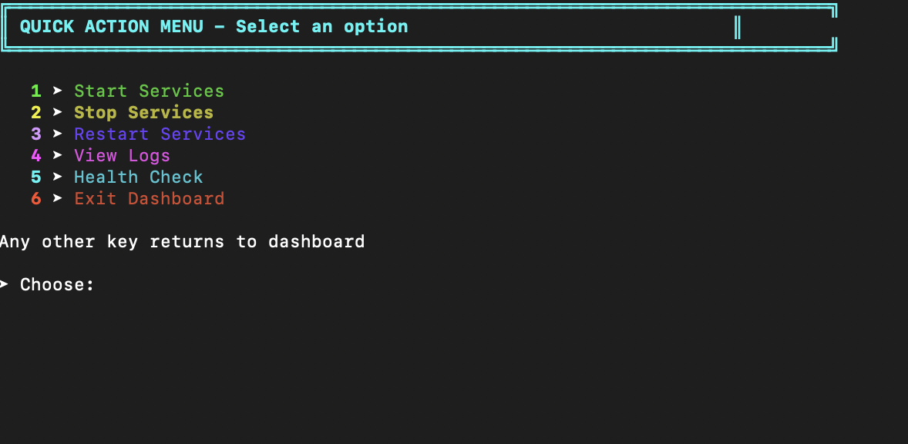

# 🚀🤖 AI CONTROL CENTER 🤖🚀

### _The Ultimate Always-On Dashboard for Your AI Empire_

<p align="center">

</p>

<p align="center">


</p>

[](https://opensource.org/licenses/MIT)
[](https://www.gnu.org/software/bash/)
[](https://www.docker.com/)
[](https://github.com)

**🎯 MISSION:** _Transform your terminal into a CYBERPUNK AI COMMAND CENTER!_

---

## 🌟 **THE LEGENDARY FEATURES** 🌟

### 🎮 **REAL-TIME DASHBOARD**

- ⚡ **LIVE METRICS** - CPU, Memory, Disk usage
- 📊 **ANIMATED PROGRESS BARS** with color-coded status
- 🎭 **SPINNING INDICATORS** and pulse animations
- 🕐 **AUTO-REFRESH** every 2 seconds
- 🌈 **256-COLOR TERMINAL** eye candy

### 🤖 **AI SERVICE CONTROL**

- 🚀 **OLLAMA SERVER** management
- 💎 **OPEN WEBUI** container orchestration
- 🔧 **DOCKER ENGINE** monitoring
- ⚙️ **ONE-CLICK OPERATIONS** (start/stop/restart)
- 📋 **HEALTH DIAGNOSTICS** with detailed reports

---

## 🎪 **VISUAL SPECTACLE** 🎪

```bash
╔══════════════════════════════════════════════════════════════════════════════╗
║ 🤖 AI CONTROL CENTER - Live Dashboard ⠋ Auto-Refresh: 2s                   ║
║ Real-time monitoring • Status updates • Resource tracking                   ║
╚══════════════════════════════════════════════════════════════════════════════╝

🔧 SERVICE STATUS                    ⚡ SYSTEM RESOURCES

➤ Ollama Service    ✅ ONLINE         CPU Usage: 15.3%
   • PID: 12345 | Port: 11434        [████████████████████]
   • Status: Ready & Listening        Memory: 8.2G/16G (51%)
                                     [██████████▒▒▒▒▒▒▒▒▒▒]

➤ Open WebUI       ✅ ONLINE         Disk (/): 45G/100G (45%)
   • Port: 3210 | Container: Active   [█████████▒▒▒▒▒▒▒▒▒▒▒]
   • URL: http://localhost:3210       Uptime: 2 days, 14:32

➤ Docker Engine    ✅ RUNNING
   • Version: 24.0.7
```

---

## 🚀 **QUICK START GUIDE** 🚀

### ⚡ **INSTANT DEPLOYMENT**

```bash
# 1️⃣ Clone the repository
git clone https://github.com/yourusername/ai-control-center.git
cd ai-control-center

# 2️⃣ Make it executable
chmod +x script.sh

# 3️⃣ LAUNCH THE BEAST! 🔥
./script.sh
```

### 🎯 **REQUIREMENTS CHECKLIST**

- ✅ **Bash 4.0+** (The foundation of power)
- ✅ **Docker** (Container orchestration magic)
- ✅ **Ollama** (AI model serving excellence)
- ✅ **Terminal** with 256-color support
- ✅ **Linux/macOS** (Windows WSL2 compatible!)

---

## 🎮 **CONTROL INTERFACE** 🎮

| **KEY** | **ACTION**     | **DESCRIPTION**              |
| ------- | -------------- | ---------------------------- |
| `1`     | 🟢 **START**   | Launch all AI services       |
| `2`     | 🔴 **STOP**    | Gracefully shutdown services |
| `3`     | 🔄 **RESTART** | Full system refresh          |
| `4`     | 📋 **LOGS**    | View detailed system logs    |
| `5`     | 🩺 **HEALTH**  | Complete diagnostics report  |
| `6`     | 🚪 **EXIT**    | Close dashboard              |

---

## ⚙️ **CONFIGURATION ZONE** ⚙️

### 🔧 **CUSTOMIZATION OPTIONS**

```bash
# 🎨 Color Customization
OLLAMA_PORT=11434        # Ollama service port
WEBUI_PORT=3210         # Open WebUI port
REFRESH_INTERVAL=2      # Dashboard refresh rate (seconds)
LOG_FILE="/tmp/ai_control_menu.log"  # Log file location

# 🎭 Visual Effects
LOADING_FRAMES=('⠋' '⠙' '⠹' '⠸' '⠼' '⠴' '⠦' '⠧' '⠇' '⠏')
PULSE_FRAMES=('◐' '◓' '◑' '◒')

# 🌈 Color Palette (256-color terminal support)
BRIGHT_CYAN='\033[1;96m'
BRIGHT_PURPLE='\033[1;95m'
BRIGHT_GREEN='\033[1;92m'
# ... and 20+ more colors!
```

---

## 🎭 **FEATURE SHOWCASE** 🎭

### 🔥 **REAL-TIME MONITORING**

- **CPU Usage Tracking** with animated progress bars
- **Memory Consumption** visualization
- **Disk Space** monitoring with color-coded alerts
- **Process Information** (PID, CPU%, Memory%)
- **Container Statistics** for Docker services

### 💎 **SERVICE MANAGEMENT**

- **Background Service Control** - Non-blocking operations
- **Automatic Health Checks** - Verify service availability
- **Port Monitoring** - Ensure proper network configuration
- **Log Aggregation** - Centralized logging system
- **Status Persistence** - Remember last actions

### 🌟 **VISUAL EXCELLENCE**

- **Animated Loading Spinners** - 10 frame animation cycle
- **Color-Coded Status** - Green=Good, Red=Alert, Yellow=Warning
- **Progress Bars** - Real-time resource visualization
- **Unicode Symbols** - Modern terminal aesthetics
- **Responsive Layout** - Adapts to terminal size

---

## 🏆 **TROUBLESHOOTING GUIDE** 🏆

### 🔧 **COMMON ISSUES & SOLUTIONS**

### ❌ **"Permission Denied"**

```bash
chmod +x script.sh
sudo ./script.sh  # If system-level access needed
```

### ❌ **"Docker not found"**

```bash
# Install Docker (Ubuntu/Debian)
curl -fsSL https://get.docker.com -o get-docker.sh
sh get-docker.sh

# Add user to docker group
sudo usermod -aG docker $USER
newgrp docker
```

### ❌ **"Ollama not responding"**

```bash
# Manual Ollama installation
curl -fsSL https://ollama.com/install.sh | sh

# Start Ollama manually
ollama serve
```

### ❌ **Terminal colors not working**

```bash
# Check terminal color support
echo $TERM
export TERM=xterm-256color
```

---

## 🌟 **CONTRIBUTING TO THE LEGEND** 🌟

```bash
# 🍴 Fork the repository
# 🔨 Create your feature branch
git checkout -b feature/AmazingFeature

# 💎 Commit your changes
git commit -m 'Add some AmazingFeature'

# 🚀 Push to the branch
git push origin feature/AmazingFeature

# 🎉 Open a Pull Request
```

### **CONTRIBUTION GUIDELINES**

- 🎨 **Follow the visual style** - Keep the cyberpunk aesthetic
- 🔧 **Test thoroughly** - Ensure compatibility across systems
- 📚 **Document features** - Update README for new functionality
- 🌈 **Add color support** - Maintain the rainbow terminal experience

---

## 🎊 **HALL OF FAME** 🎊

**🏆 LEGENDARY CONTRIBUTORS 🏆**

| Avatar | Contributor      | Contribution               |
| ------ | ---------------- | -------------------------- |
| 🚀     | **You**          | _The next legend to join!_ |
| 💎     | **Future Hero**  | _Waiting for your PR_      |
| ⚡     | **Code Warrior** | _Ready to make history_    |

---

## 📜 **LICENSE & CREDITS** 📜

**MIT License** - _Because sharing is caring_ 💖

```
  ╔═══════════════════════════════════════════════════════════════════╗
  ║  Made with 💖 by developers who believe terminals should be FUN   ║
  ║                                                                   ║
  ║  Special thanks to:                                               ║
  ║  🤖 Ollama - For making AI accessible                            ║
  ║  🐳 Docker - For containerization magic                          ║
  ║  💎 Open WebUI - For beautiful AI interfaces                     ║
  ║  🌈 The terminal color gods - For 256-color support              ║
  ╚═══════════════════════════════════════════════════════════════════╝
```

---

## 🎯 **FINAL WORDS** 🎯

**Transform your boring terminal into a CYBERPUNK AI COMMAND CENTER!**

_Every great journey begins with a single `./script.sh`_

### ⭐ **STAR THIS REPO IF YOU LOVE IT!** ⭐

**💫 "The future is now, and it's running in your terminal" 💫**

---

## 🎪 **EASTER EGGS & SECRETS** 🎪

_Click to reveal if you dare!_

```bash
# 🎭 Hidden Developer Mode
export AI_CONTROL_DEBUG=1
./script.sh

# 🌈 Rainbow Mode
export RAINBOW_MODE=1
./script.sh

# 🚀 Turbo Refresh (0.5s intervals)
export TURBO_MODE=1
./script.sh

# 🎵 ASCII Art Mode
export ASCII_ART=1
./script.sh
```

_"Those who discover the secrets unlock the true power of the AI Control Center"_ 🔮
